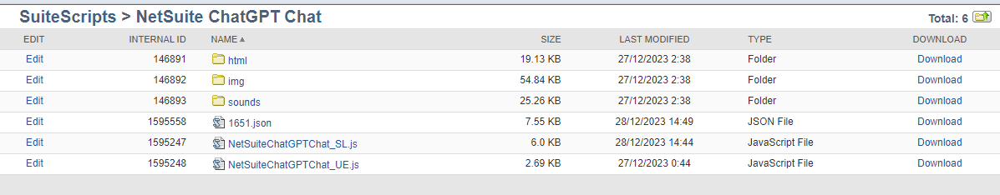

# NetSuite ChatGPT Integration
Integrate ChatGPT with NetSuite and ask questions about current transaction. 

## Basic usage ( No integration )


## What if ChatGPT refuses to complete requested tasks or produce wrong answers? Maybe its seasonal depression?


## Remembering of previous messages / history / preserving context in ChatGPT
- Since version 1.1.0, the Service Suitelet is sending back all messages from the previous conversation to the ChatGPT API.
- Context / Chat History with ChatGPT is preserved by the current user in the JSON file (each user has its own file).
- Even if you log out from NetSuite and log in again on the other day, your conversation context with ChatGPT will be preserved, and you can ask what you asked previously.


- History of previous conversation with ChatGPT for each user is preserved in the Script Folder in format UserID.json. You can delete previous conversation by deleting the JSON file.



## Example of historical context in ChatGPT
**USER:** _Please remember my name and always reply with: "<u>**George**</u>, here is your answer:"_

**ASSISTANT:**
_Understood, <u>**George**</u>! I will remember your name and reply with "<u>**George**</u>, here is your answer:" before providing the response. How can I assist you today?_

**USER:**
_where to find Reports?_

**ASSISTANT:**
_<u>**George**</u>, here is your answer: To find Reports in NetSuite: 1. Log in to your NetSuite account. 2. Navigate to the "Reports" menu at the top of the page. 3. Select the desired report category, such as Financial, Sales, or Inventory. 4. From the drop-down menu, choose the specific report you want to access. 5. This will take you to the Report page, where you can customize the report parameters and generate the report based on your preferences._

**USER:** _Thanks!_

**ASSISTANT:**
_You're welcome, <u>**George**</u>! If you have any more questions, feel free to ask. I'm here to help!_

**.... on the other day:**

**USER:** 
_Where to find saved searches?_

**ASSISTANT:**
_<u>**George**</u>, here is your answer: To find saved searches in NetSuite: 1. Log in to your NetSuite account. 2. Navigate to the "Lists" menu at the top of the page. 3. Select "Search" from the drop-down menu. 4. In the second drop-down menu, click on "Saved Searches". 5. This will take you to the Saved Searches menu page, where you can view and manage your saved searches._

**.... on the day after tomorrow:**

**USER:** _Hello_

**ASSISTANT:**
_Hello, <u>**George!**</u> How can I assist you today?_
> More information can be found here: https://community.openai.com/t/gpt-3-5-turbo-how-to-remember-previous-messages-like-chat-gpt-website/170370/5

## NetSuite ChatGPT Integration
- Since version 1.2.0 you can integrate NetSuite with ChatGPT via !givemorecontext magic word
- You can set template and which transaction fields to be exposed to ChatGPT when calling !givemorecontext in NetSuiteChatGPTChat_SL

## How to integrate ChatGPT with NetSuite?
You can integrate / give more context to ChatGPT by exposing sensitive data like transaction number, transaction amount or any other transaction field values.

This is possible by enabling context mode in NetSuiteChatGPTChat_UE:
```
const contextMode = true;
```
The magic word, exposed fields and prompt that give more context to ChatGPT can be configured in NetSuiteChatGPTChat_SL:
```
const CONTEXT_MAGIC_WORD = '!givemorecontext';
const CONTEXT_EXPOSED_FIELDS = ['tranid'];
const CONTEXT_PROMPT = "I'm currently logged into NetSuite and viewing Sales Order ${tranid}";
```

Then in the chat popup just say: !givemorecontext. If contextMode is set to true in NetSuiteChatGPTChat_UE, the UserEvent will instruct the service Suitelet that you're in context mode, Suitelet will source and replace field values from the current transaction in your prompt and send it to ChatGPT.

The chat box will ⚠️ WARN YOU ⚠️ that you're exposing / sending sensitive information to OpenAI API. 

Then ChatGPT will confirm your context:


Then you can ask more specific questions about the data you exposed:


> [!CAUTION]
> If context mode is enabled, SENSITIVE information will be shared with OpenAI / ChatGPT.

> [!CAUTION]
> Use at your own risk.

> [!CAUTION]
> I'm not responsible for any data leak by using this software.

## Advanced NetSuite / ChatGPT Integration Usage Example
```
const CONTEXT_EXPOSED_FIELDS = ['tranid', 'trandate', 'shipdate'];
const CONTEXT_PROMPT = "I'm currently logged into NetSuite and viewing Sales Order ${tranid}, transaction date is ${trandate}, ship date is set to ${shipdate}";
```

NetSuite's transaction field values are:
```
TRANDATE = 16/07/2023
SHIPDATE = 17/07/2023
```

### Example ChatGPT conversation with exposed transaction fields:

**USER:** _Today is 29/12/2023, how many days have passed since the shipping date?_

**ASSISTANT:** _The ship date you provided was 17th July 2023 and today's date you provided is 29th December 2023. To find out how many days have passed since the shipping date, you would subtract the ship date from today's date. Using a standard online date calculator, the result would be 165 days. So, 165 days have passed since the ship date of 17th July 2023 as of 29th December 2023. Please note that the calculation is inclusive, meaning it includes both the start date (17th July 2023) and end date (29th December 2023) in the calculation. Let me know if there's anything else you need help with!_

**USER:** _Please reply with short answer giving the final result_

**ASSISTANT:** _165 days have passed since the ship date._

Screenshots:


### NetSuite / ChatGPT Conversation in JSON:
```
[
    ... previous history omitted
    {
        "role": "user",
        "content": "I'm currently logged into NetSuite and viewing Sales Order SLS00000631, transaction date is 16/07/2023, ship date is set to 17/07/2023"
    },
    {
        "role": "assistant",
        "content": "Hello! The information you've provided indicates that you're viewing a sales order, SLS00000631, in NetSuite with a transaction date of 16th July 2023. The transaction date is typically the date when the order was entered into the system or agreed upon with the customer. \n\nIn addition, the ship date is set to 17th July 2023. This is the scheduled date on which the products in the sales order are expected to be shipped to the customer – in this case, a day after the transaction date. \n\nRemember that the ship date depends on various parameters like the product availability, shipping method, and the customer's location. Also, the status of the order (pending, partially shipped, shipped, etc.) affects the scheduling and execution of the shipment.\n\nThis is standard in many businesses to ensure that the ordered items are sent promptly, satisfying customers' expectations, and keeping a healthy cash flow.\n\nIf there are any adjustments needed (either in your order details or shipping schedule), you can make them by editing the sales order, provided your user role in NetSuite has the necessary permissions. \n\nLet me know if you have further questions or need assistance with other NetSuite functionalities."
    },
    {
        "role": "user",
        "content": "today is 29/12/2023, how many days have passed since the shipping date?"
    },
    {
        "role": "assistant",
        "content": "The ship date you provided was 17th July 2023 and today's date you provided is 29th December 2023. \n\nTo find out how many days have passed since the shipping date, you would subtract the ship date from today's date.\n\nUsing a standard online date calculator, the result would be 165 days. \n\nSo, 165 days have passed since the ship date of 17th July 2023 as of 29th December 2023.\n\nPlease note that the calculation is inclusive, meaning it includes both the start date (17th July 2023) and end date (29th December 2023) in the calculation. Let me know if there's anything else you need help with!"
    },
    {
        "role": "user",
        "content": "please reply with short answer giving the final result"
    },
    {
        "role": "assistant",
        "content": "165 days have passed since the ship date."
    }
]
```

## Architecture
- **NetSuiteChatGPTChat_UE UserEvent Script**
  - Adds INLINEHTML field on beforeLoad
  - Content including html, js, css is injected from ./html/chat.html file into INLINEHTML field
  - User Event is deployed on Sales Order record and chat popup will show on scriptContext.UserEventType.VIEW
- **NetSuiteChatGPTChat_SL Suitelet Script**
  - Acts like service to connect to OpenAI API / ChatGPT
  - Message requests are sent to NetSuiteChatGPTChat_SL > OpenAI by chat.html
  - Messages responses are received from NetSuiteChatGPTChat_SL < OpenAI and rendered in the chat popup by chat.html
  - Messages are preserved in JSON file by User ID (each user has its own file)
  - Integrates ChatGPT with NetSuite if contextMode is set to true in NetSuiteChatGPTChat_UE ( **CAUTION:** sensitive NetSuite data is sent to ChatGPT / OpenAI API )

## How to switch between ChatGPT 3.5 / ChatGPT 4 / ChatGPT 4 Turbo?
In NetSuiteChatGPTChat_SL:
```
const OPENAI_MODEL = OPENAI_MODELS.GPT3; for ChatGPT 3.5-Turbo (Default)
const OPENAI_MODEL = OPENAI_MODELS.GPT4; for ChatGPT 4 (May answer slower)
const OPENAI_MODEL = OPENAI_MODELS.GPT4TURBO; for ChatGPT 4 Turbo
```

## How to adjust ChatGPT model temperature?
In NetSuiteChatGPTChat_SL:

```
const OPENAI_TEMPERATURE = 1; //What sampling temperature to use, between 0 and 2. Higher values like 0.8 will make the output more random, while lower values like 0.2 will make it more focused and deterministic. Defaults to 1
```

## Supported OpenAI ChatGPT Models:
 OpenAI Model              | Description                                                                                                                                                                                                                                                  | Config Option in NetSuiteChatGPTChat_SL                             |
|--------------------|--------------------------------------------------------------------------------------------------------------------------------------------------------------------------------------------------------------------------------------------------------------|-----------------------------------------------|
| gpt-4-1106-preview | **GPT-4 Turbo**<br/>The latest GPT-4 model with improved instruction following, JSON mode, reproducible outputs, parallel function calling, and more. Returns a maximum of 4,096 output tokens. This preview model is not yet suited for production traffic. | const OPENAI_MODEL = OPENAI_MODELS.GPT4TURBO; |
| gpt-4      | Currently points to gpt-4-0613                                                                                                                                                                                                                                          | const OPENAI_MODEL = OPENAI_MODELS.GPT4;      |
| gpt-3.5-turbo-1106 | **Updated GPT 3.5 Turbo**<br/>The latest GPT-3.5 Turbo model with improved instruction following, JSON mode, reproducible outputs, parallel function calling, and more. Returns a maximum of 4,096 output tokens.| const OPENAI_MODEL = OPENAI_MODELS.GPT3;      
> More information about OpenAI models can be found here https://platform.openai.com/docs/models

## Considerations
- May break NetSuite functionalities / views
- Not a PRODUCTION version
- Not well tested
- Can expose sensitive data
- Use at your own risk

## How to Set up
- Place your OpenAI API Key in NetSuiteChatGPTChat_SL:
```
const OPENAI_API_KEY = '';
```
- Initial system prompt to ChatGPT can be customized. Currently, "You are a NetSuite assistant, skilled in NetSuite concepts with creative flair.":
```
const SYSTEM_PROMPT = 'You are a NetSuite assistant, skilled in NetSuite concepts with creative flair.';
```
## How to obtain OpenAI / ChatGPT API Keys
- Go to https://platform.openai.com/api-keys
- Click on "+Create new secret key"

- Enter name E.g. NetSuite

- Click on "Create secret key" & copy secret

- Edit NetSuiteChatGPTChat_SL.js and put secret in OPENAI_API_KEY const

## Credits
- Popup-chat-window (https://github.com/KRISHNAPRASADEK/Popup-chat-window)

## Screenshots


